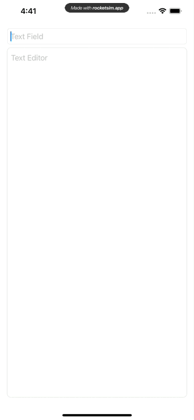
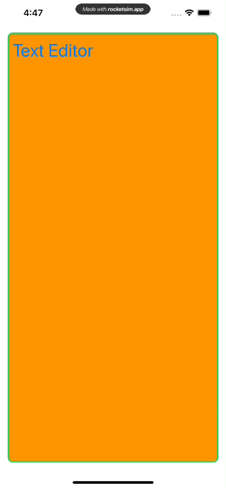

# AFTextEditor

##### SwiftUI TextEditor has same draw backs that you can not add a placeholder or any customisation easily.

## Installation

Add this Swift package in Xcode using its Github repository url. (File > Swift Packages > Add Package Dependency...)

## Usage

```swift
import AFTextEditor
```

If you want the placeholder and binding text with the same styling as ```RoundedBorderTextFieldStyle()``` then 

```swift
struct ContentView: View {
    @State private var textEditor = ""
    @State private var textField = ""
    
    var body: some View {
        VStack {
            TextField("Text Field", text: $textField)
                .textFieldStyle(RoundedBorderTextFieldStyle())

            TextEditorField("Text Editor", text: $textEditor)
        }
        .padding()
    }
}
```



You can also change the way it look by parameters. With added the .foregroundColor and .font change the display

```swift
struct ContentView: View {
    @State private var textEditor = ""

    var body: some View {
            TextEditorField("Text Editor",
                            borderColor: .green,
                            borderLine: 3,
                            textColor: .accentColor,
                            backgroundColor: .orange,
                            text: $textEditor)
                .foregroundColor(.purple)
                .font(.largeTitle)
                .padding()
    }
}
```




## License

This package is released under the MIT License, which is copied below.

Copyright (c) 2021 Nigel Gee

Permission is hereby granted, free of charge, to any person obtaining a copy of this software and associated documentation files (the "Software"), to deal in the Software without restriction, including without limitation the rights to use, copy, modify, merge, publish, distribute, sublicense, and/or sell copies of the Software, and to permit persons to whom the Software is furnished to do so, subject to the following conditions:

The above copyright notice and this permission notice shall be included in all copies or substantial portions of the Software.

THE SOFTWARE IS PROVIDED "AS IS", WITHOUT WARRANTY OF ANY KIND, EXPRESS OR IMPLIED, INCLUDING BUT NOT LIMITED TO THE WARRANTIES OF MERCHANTABILITY, FITNESS FOR A PARTICULAR PURPOSE AND NONINFRINGEMENT. IN NO EVENT SHALL THE AUTHORS OR COPYRIGHT HOLDERS BE LIABLE FOR ANY CLAIM, DAMAGES OR OTHER LIABILITY, WHETHER IN AN ACTION OF CONTRACT, TORT OR OTHERWISE, ARISING FROM, OUT OF OR IN CONNECTION WITH THE SOFTWARE OR THE USE OR OTHER DEALINGS IN THE SOFTWARE.